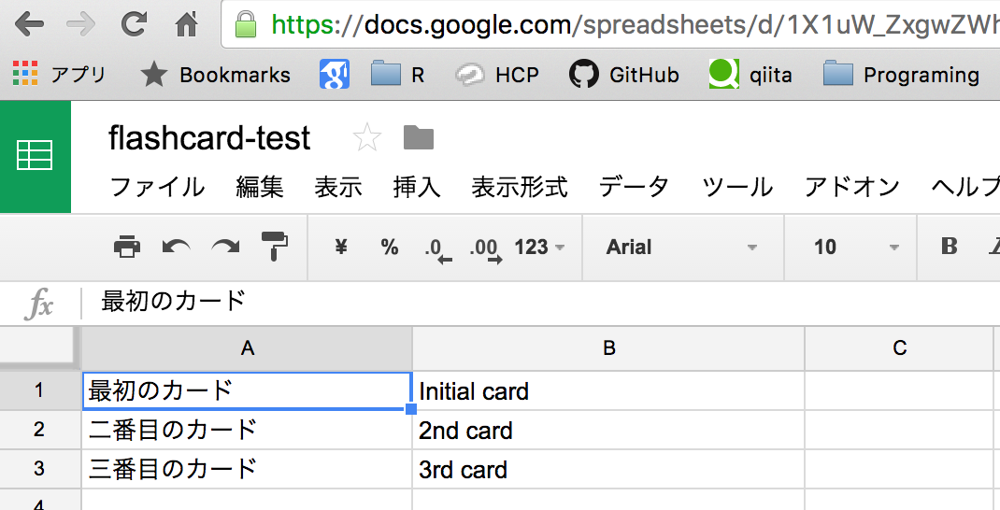
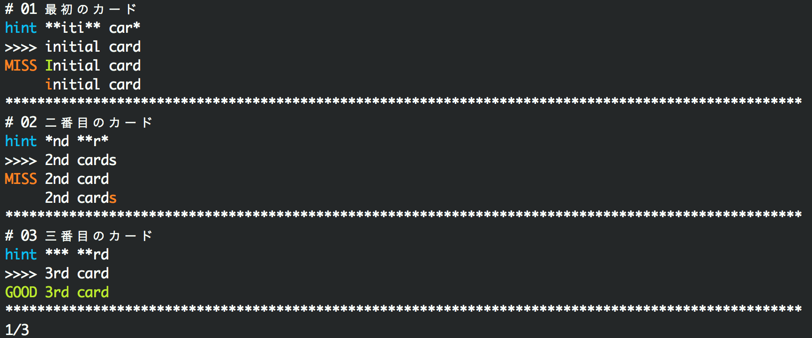

[](https://travis-ci.org/sotetsuk/flashcard)
[](https://coveralls.io/github/sotetsuk/flashcard?branch=master)
[](https://github.com/sotetsuk/flashcard)
[](https://badge.fury.io/py/flashcard)
[](https://github.com/sotetsuk/flashcard)

# flashcard
Simple flashcard in your terminal

## Example

### 1. Prepare flashcard in Google Spreadsheet: [example](https://docs.google.com/spreadsheets/d/1X1uW_ZxgwZWh9elAI1jJCYkiCbmDL-xH2zkCMEZEV4g/edit?usp=sharing)



### 2. Copy the url and learn the flashcard!

```sh
$ flashcard --hint 0.5 https://docs.google.com/spreadsheets/d/1X1uW_ZxgwZWh9elAI1jJCYkiCbmDL-xH2zkCMEZEV4g/edit?usp=sharing
```




## Features

- Making flashcard from (shared) Google Spreadsheet
- Colorful diff feedback
- Hinting option for begginers

## Requirements

- Python 3.5 or later
- docopt
- requests

## Installing

```sh
$ pip install flashcard
```


### Building
You can build from source codes: 

```sh
$ make build
```

## License
MIT License
